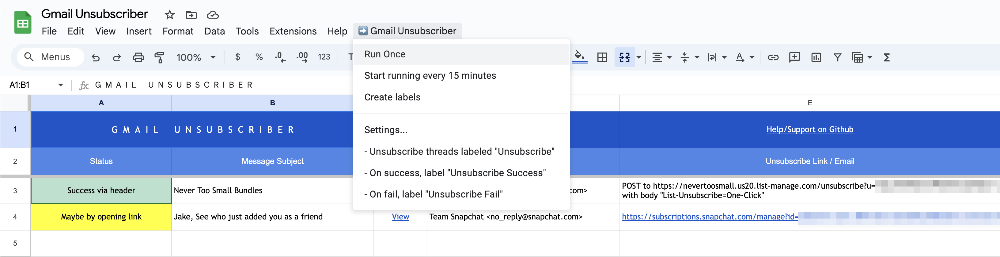

# gmail-unsubscribe

This Google Apps Script + Google Spreadsheet combo unsubscribes you from all the messages with a specific label (default "Unsubscribe").  Unlike services such as Unroll.me that [sell your data](https://www.theverge.com/2019/12/17/21027159/unroll-me-email-privacy-ftc-settlement) but [don't actually work](https://www.nytimes.com/wirecutter/reviews/best-email-unsubscribe-service/), this script is **completely private**: all data stays in your Google account, and you can verify the script's behavior by reading its source before giving it access to your account.

## Usage

### Run for the first time

1. [Copy the Gmail Unsubscriber to your Google Drive](https://docs.google.com/spreadsheets/d/10sQyFyQ_EsyZ_MWs1UtSBzPkBM9SuDlaFrTNhWoo07w/copy). This copy, including the code, is completely private to you and can't be accessed or updated by anyone else.
1. (Optional) Review the code by choosing "Extensions > Apps Script" in the menu bar.
1. Note the "Gmail Unsubscriber" menu above the spreadsheet.
1. (Optional) To change the labels the script uses, chose "Gmail Unsubscriber > Settings..."
1. Choose "Gmail Unsubscriber > Create labels". This will create the labels in your Gmail account. Allow the script to access to your Gmail account when prompted.
1. Open your Gmail inbox, and add the "Unsubscribe" label to some unwanted emails. You can click and drag emails onto the label.
1. Return to the spreadsheet and choose "Gmail Unsubscriber > Run Now" to unsubscribe from the messages you just tagged. After a few moments, you should see the status of each thread appear in the spreadsheet.

### Running automatically

You can choose "Gmail Unsubscriber > Start running" to run the script periodically, even when the spreadsheet is closed.

That way, you can drop new emails into the "Unsubscribe" label whenever you want, and the script will automatically unsubscribe from them.

You can use Gmail filters to automatically add the "Unsubscribe" label to certain kinds of emails or senders, too.

### Troubleshooting

If we can't figure out how to unsubscribe from a thread or an error occurs, we'll add a note to the spreadsheet, and re-label the email "Unsubscribe Failed". You can click on the thread's subject to open it in Gmail and unsubscribe manually.

### Remove

- Temporarily disable: choose "Gmail Unsubscriber > Stop running" to stop the script from running automatically.
- Permanently remove: delete the sheet from your Drive.

## How it works

Google Apps Script provides an API that lets us connect to your Gmail account from a Google Sheet. We use that API to query threads with the label "Unsubscribe" (configurable). For each thread, we try several methods to unsubscribe:

- Emails from reputable lists include a [`list-unsubscribe`](https://sendgrid.com/blog/list-unsubscribe/) header, which is a machine-readable instruction for how to automatically unsubscribe.
  - Ideally the header specifies a `mailto:` link like `mailto:unsubscribe@example.com?subject=XXXXX` that specifies how to unsubscribe from the list by sending an email. If we see this, we sent the unsubscribe email automatically.
  - If the header specifies a web address like `https://example.com/unsubscribe?id=XXXXX`, we sent an HTTP `POST` request to that address.
- If no header is found, we look in the email's HTML body for links that contain the word "unsubscribe". If found, we send an HTTP `GET` request to that URL. This may not work if they expect you to interact with the page to unsubscribe.

Then, we record the status of the thread in the spreadsheet, and change the label of the thread from "Unsubscribe" to "Unsubscribe Success" or "Unsubscribe Failed" (configurable).

## Developer info

The software is made of two parts - a Google Sheet for the UI, and the Apps Script source that powers the actions. This repo only contains the Apps Script source, and needs to connect to a Google Sheet to work. We use [google/clasp](https://github.com/google/clasp) to manage the Apps Script source.

Once you [copy the sheet to your account](#usage),
you can edit the `.clasp.json` file to point to your copy's ID.

Then, install development dependencies with `yarn install` or `npm install`.

To deploy the script to your account, run `yarn push` or `npx clasp push`. The first time you do this, `clasp` will walk you through authorizing your Google Account and enabling the Apps Script API. See the [clasp guide](https://developers.google.com/apps-script/guides/clasp) for more info.

You can add `--watch` to the push command to push whenever you edit a file.

## Credits

The original 2017 version of gmail-unsubscribe was written by Amit Agarwal. Read the original article here: [How to Unsubscribe from Mailing Lists and Junk Newsletters in Gmail](https://www.labnol.org/internet/gmail-unsubscribe/28806/)

[Jake Teton-Landis](https://jake.tl) rewrote the script in Typescript, added features, and corrected issues that made the original ineffective.
